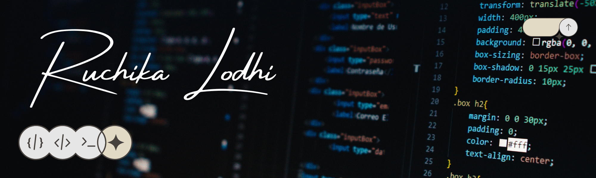

<h1 align="center">Hi there, I'm <a href="https://github.com/ruchikalodhi" target="_blank">Ruchika Lodhi</a> 
</h1>
<h3 align="center">Computer Science and Engineering (CORE) Undergraduate @ VIT Bhopal</h3>

  

 

  
  
   

## 👩‍💻 About Me

Driven Computer Science undergraduate at Vellore Institute of Technology (VIT, Class of 2027) with robust technical expertise in Python, C++, Java, and front-end development (HTML, CSS, JavaScript). Experienced in software design, collaborative coding, and deploying user-centered web solutions for academic and club projects. 

Currently serving as **Design Team Lead at M-TFAC VITB**, guiding creative planning and project management for major campus initiatives. Active participant in **BashCraft Club VITB**, consistently demonstrating leadership, teamwork, and communication while organizing interdisciplinary design solutions. Regularly engaged in coding challenges and hackathons (#DrGVishwanathan Challenge, #100DaysofCode), continuously enhancing problem-solving ability and professional growth in both technical and social domains.

---

## 🛠️ Languages and Tools

   
   
  
   
  
   
   
  

*   **Languages**: Java, Python, C++, JavaScript, SQL
*   **Web**: HTML, CSS
*   **Cloud/Other**: Google Cloud Platform, Big Data & AI/ML concepts

---

## 📈 Coding Stats & Achievements

| Platform | Stats |
| :--- | :--- |
| **Problem Solving** | Solved: 229 \| Rank: 554,644 \| Contest Rating: 1,413 |
| **GeeksForGeeks** | Solved: 151 \| Rank: 631 \| POTD Streak: 60 \| Coding Score: 484 |

*   **HackerRank**: 
    *   Problem Solving (Basic) Certificate (Dec 2024)
    *   SQL (Basic) Certificate (Nov 2024)
    *   Python (Basic) Certificate (Oct 2024)
*   **Vityarthi**:
    *   Programming in Java (Apr 2025)
    *   Python Essentials (Oct 2024)
    *   Artificial Intelligence Fundamentals (Dec 2023)
*   **Other**:
    *   NPTEL Introduction to Machine Learning (May 2025)
    *   AcWoC 2025 Challenge (Jan 2025)
    *   UXquisite Hackathon Certification (Dec 2023)
    *   MATLAB Onramp Certification (Sep 2023)

---

## 🎓 Education

**Vellore Institute of Technology, Bhopal** (2023 - 2027)
*   **Degree**: B.Tech in Computer Science and Engineering (Core)
*   **CGPA**: 8.66

**Ramakrishna Mission, Gwalior**
*   **12th Standard**: 88%
*   **10th Standard**: 91%

---

## 💼 Experience & Leadership

Now: **Design Team Lead @ Meraki - The Fine Arts Club (VITB)** (Oct 2023 - Present)
*   Lead design projects and manage creative team efforts.
*   Overseeing club events and initiatives.

Now: **Core Design Member @ BashCraft Club VIT Bhopal** (Oct 2024 - Present)
*   Collaborate on club branding and design creation.

Now: **Design Team @ Anime Club - VIT Bhopal** (Oct 2024 - Present)
*   Assist in promotional media and event design.

Past: **Google Cloud Skills Boost (Remote)** (Aug 2025 - Present)
*   Engaged in cloud computing and application development training programs.

---

