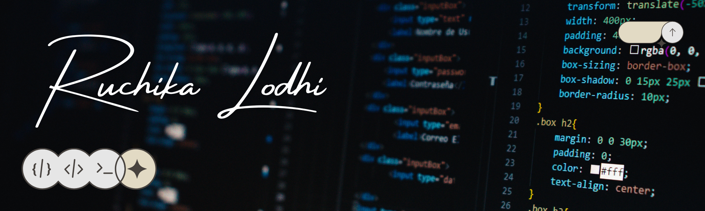
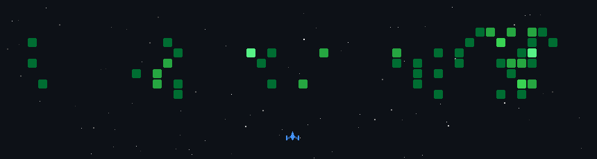

<h1 align="center">Hi there, I'm <a href="https://github.com/ruchikalodhi" target="_blank">Ruchika Lodhi</a> 
</h1>

  

 

<h2 align="center">Connect with Me </h2>

  
  
  
  
  

## 👩‍💻 About Me

Driven **Computer Science & Engineering undergraduate at Vellore Institute of Technology (Class of 2027)** with experience spanning **full-stack web development, network automation, and applied machine learning**. 

* **Industry Experience:** Former **IT & Automation Intern at BPCL (Bina Refinery)**, where I built enterprise network monitoring and AI-powered cybersecurity solutions using FastAPI, React.js, and ML.
* **Core Technical Stack:** Proficient in **Python, C++, Java, and SQL**, alongside web and backend technologies including **React.js, Node.js, FastAPI, REST APIs, and WebSockets**.
* **Specialized Focus:** Hands-on work in **Network Performance Monitoring & Security** (SNMP, SSH, Cisco IOS) and **Applied Machine Learning** (threat intelligence, malware detection, Scikit-learn, XGBoost).
* **Leadership & Creative Design:** Serving as **Student Coordinator (President)** and former **Design Lead** for *Meraki – The Fine Arts Club & Anime Club*, and a design contributor at *BashCraft Club, Vellore Institute of Technology*.
* **Problem Solving:** Solved **370+ algorithmic problems** across LeetCode (200+) and GeeksforGeeks (170+).

---

## 🛠️ Languages and Tools

  
  &nbsp;
  
  &nbsp;
  
  &nbsp;
  
  &nbsp;
  
  &nbsp;
  
  &nbsp;
  
  &nbsp;
  
  &nbsp;
  
  &nbsp;
  
  &nbsp;
  
  &nbsp;
  
  &nbsp;
  
  &nbsp;
  

* **Languages**: Python, C++, Java, SQL
* **Frameworks & Web**: HTML, CSS, React.js, FastAPI, Node.js, REST APIs, WebSockets
* **Machine Learning**: Scikit-learn, Random Forest, XGBoost, SVM, KNN, SHAP, Feature Engineering
* **Databases**: MySQL, SQLite, MongoDB
* **Networking & Security**: SNMP, SSH, ICMP, Cisco IOS, Network Monitoring
* **Developer Tools**: Git, GitHub, Netmiko, PySNMP, PyShark, Streamlit, VS Code
* **Design & Creative**: Graphic Design, Canva, Branding, Social Media Creatives, Poster Design

---

## 📈 Coding Stats & Achievements

*   **Competitive Programming & Problem Solving**:
    *   Solved **370+ DSA & coding challenges** across LeetCode and GeeksforGeeks
*   **Programs & Certifications**:
    *   ServiceNow Virtual Internship Program (SmartBridge / AICTE)
    *   Google Cloud Skills Boost Trainee (Google Cloud)
    *   HackerRank: Problem Solving (Basic), SQL (Basic), Python (Basic)
    *   NPTEL: Introduction to Machine Learning
    *   Vityarthi: Programming in Java, Python Essentials, Artificial Intelligence Fundamentals
    *   MATLAB Onramp Certification
*   **Hackathons & Challenges**:
    *   AcWoC 2025 Challenge
    *   UXquisite Hackathon
    *   #DrGVishwanathan Challenge & #100DaysofCode

-----------------------------------
## 🚀 Featured Projects

* **[Enterprise Network Performance Monitoring (NPM) Dashboard](https://github.com/ruchikalodhi/NetOPs)**
  * Full-stack monitoring platform built with **Python, FastAPI, React, and TypeScript** for real-time surveillance of Cisco IOS/IOS-XE devices via SNMP and SSH.
  * Engineered automated network topology discovery (LLDP/CDP walks), an SNMP trap-based incident management engine, AES-256-GCM encrypted configuration backups, and an integrated in-browser SSH terminal.

* **[ShieldAI – AI Threat Intelligence & Malware Detection Platform](https://github.com/ruchikalodhi/Malware-Detection-System)**
  * Machine learning classification engine utilizing **Random Forest**, **SHAP explainability**, and **MITRE ATT&CK** mapping for transparent, evidence-backed security verdicts.
  * Benchmarked 6 ML classifiers across the UNSW-NB15 dataset to optimize network intrusion and threat detection.

---

---

